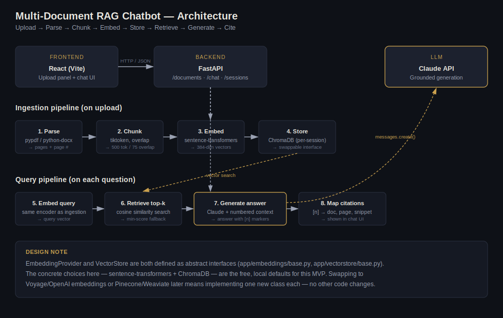

# Multi-Document RAG Chatbot

Upload one or more PDF, DOCX, or TXT files and ask questions about them in plain English. Every answer is grounded in the uploaded documents and comes with clickable citations pointing back to the exact document and page it was drawn from — no answer is generated without evidence, and the app says so explicitly when it can't find a relevant passage.

Built as a portfolio project to demonstrate a complete, production-shaped Retrieval-Augmented Generation (RAG) pipeline: document parsing, chunking, embeddings, vector search, and grounded LLM generation, wired together behind a FastAPI backend and a React frontend.

**Live demo:** _add your deployed URL here after following the Deployment section below_



## What it does

1. **Upload** — drag in one or more PDF / DOCX / TXT files.
2. **Ingest** — each document is parsed, split into overlapping chunks, embedded, and stored in a per-session vector index.
3. **Ask** — type a question. The app embeds it, retrieves the most relevant chunks across *all* your uploaded documents, and asks Gemini to answer using only that retrieved context.
4. **Verify** — every claim in the answer carries a `[n]` marker. Click a citation to expand the exact snippet, source filename, and page number it came from.
5. **No answer found** — if retrieval doesn't turn up anything relevant, the app says so instead of letting the model guess.

## Why RAG, and why these design choices

A plain LLM chatbot can't answer questions about your private documents, and even if you paste document text into a prompt, you're stuck with the model's context window and you lose any way to verify *where* an answer came from. RAG solves both problems: retrieval keeps only the relevant slice of a (potentially huge) document set in the prompt, and carrying chunk metadata (document, page, chunk index) through the whole pipeline is what makes citations possible rather than an afterthought.

A few decisions worth calling out for anyone reading the code:

- **Interfaces over implementations.** `EmbeddingProvider` (`backend/app/embeddings/base.py`) and `VectorStore` (`backend/app/vectorstore/base.py`) are abstract base classes. The MVP ships `SentenceTransformerProvider` and `ChromaVectorStore`, but nothing else in the app talks to sentence-transformers or ChromaDB directly — only to the interface. Swapping to a hosted embedding API or Pinecone/Weaviate later is a two-class change, not a rewrite.
- **Page-aware chunking.** Chunks are built per-page (never spanning two PDF pages) and tagged with `page_number` before they ever reach the vector store, so a citation can honestly say "page 4" instead of "somewhere in this file."
- **Citation numbers are the model's own numbers.** Retrieved chunks are shown to Gemini as a numbered list (`[1]`, `[2]`, ...) and the model is instructed to cite inline using those numbers. The backend then parses which numbers actually appear in the answer and returns *only* those chunks as citations — so the UI never shows "evidence" the model didn't actually rely on.
- **A real "I don't know."** If the best-matching chunk falls below a similarity threshold, the backend short-circuits before ever calling the LLM and returns a "no relevant content found" response. This is deliberately not delegated to the model — it's cheaper, faster, and more reliable than hoping the model declines to hallucinate.
- **One Chroma collection per chat session.** This gives free multi-tenancy (your documents are never searched against someone else's session) and makes "clear my documents" a single collection drop instead of a filtered delete.

## Tech stack

| Layer | Choice | Why |
|---|---|---|
| Backend | FastAPI (Python) | Async, typed, auto-generates OpenAPI docs at `/docs` |
| Frontend | React + Vite | Fast dev loop, minimal boilerplate for a focused UI |
| Parsing | `pypdf`, `python-docx` | Pure-Python, no external binary dependencies |
| Chunking | Token-based via `tiktoken`, with overlap | Chunk size is measured in the unit that actually matters for context-window budgeting |
| Embeddings | `sentence-transformers` (`all-MiniLM-L6-v2`), local | Free, no API key, no rate limits — see tradeoffs below |
| Vector store | ChromaDB, local file-based | Zero external services to stand up for an MVP; swappable via `VectorStore` interface |
| LLM | Google Gemini API (`gemini-2.5-flash`) | Grounded generation over retrieved context, on a genuinely free, ongoing tier |

### Embeddings: local model vs. hosted API

This was the one real build-vs-buy decision in the project, so it's worth documenting the tradeoff I made:

- **`sentence-transformers` (chosen):** free, runs on CPU, no external API key, no per-call cost or rate limit. Downside: a ~90 MB model to bundle/download, and somewhat lower retrieval quality on tricky domain-specific text than a top hosted model.
- **Hosted embeddings (e.g. Voyage AI, OpenAI):** noticeably better retrieval quality, and a much lighter backend container (no `torch`), which matters on free-tier hosts with limited RAM/cold-start budgets. Downside: another API key, network dependency, and (usually small) per-call cost.

I went local-first to keep the whole project running on free tiers end to end — Gemini's API for generation and sentence-transformers for embeddings — and because implementing the embedding step myself (rather than delegating it to an API) was better practice for actually understanding what's happening. The `EmbeddingProvider` interface means switching to Voyage/OpenAI later is one new file.

## Repository structure

```
multidoc-rag-chatbot/
├── backend/
│   ├── app/
│   │   ├── main.py                 # FastAPI app + router wiring
│   │   ├── config.py                # env-driven settings
│   │   ├── dependencies.py          # DI: which concrete classes back each interface
│   │   ├── api/                     # routes: /documents, /chat, /sessions/{id}/history
│   │   ├── ingestion/               # parsers.py (PDF/DOCX/TXT), chunker.py
│   │   ├── embeddings/              # base.py (interface) + sentence_transformer_provider.py
│   │   ├── vectorstore/             # base.py (interface) + chroma_store.py
│   │   ├── rag/                     # retriever.py, generator.py
│   │   ├── session/                 # in-memory chat history store
│   │   └── models/                  # Pydantic request/response schemas
│   ├── requirements.txt
│   ├── Dockerfile
│   └── .env.example
├── frontend/
│   ├── src/
│   │   ├── App.jsx, App.css
│   │   ├── components/              # UploadPanel, ChatWindow, MessageBubble, CitationBadge
│   │   └── api/client.js
│   └── .env.example
├── docs/architecture-diagram.svg
└── docker-compose.yml               # one-command local backend
```

## Running locally

### Prerequisites

- Python 3.11+
- Node 18+
- A free [Google Gemini API key](https://aistudio.google.com/) (click "Get API key" — no credit card required)

### Backend

```bash
cd backend
python -m venv venv
source venv/bin/activate          # Windows: venv\Scripts\activate
pip install -r requirements.txt

cp .env.example .env
# then edit .env and set GEMINI_API_KEY

uvicorn app.main:app --reload --port 8000
```

The API is now at `http://localhost:8000`, with interactive docs at `http://localhost:8000/docs`.

> First run will download the `all-MiniLM-L6-v2` embedding model (~90 MB) — this happens once and is cached locally afterward.

### Frontend

```bash
cd frontend
npm install
cp .env.example .env      # defaults to http://localhost:8000, adjust if needed
npm run dev
```

Open `http://localhost:5173`, upload a document, and start asking questions.

### Or, backend via Docker

```bash
cp backend/.env.example backend/.env   # then set your API key
docker compose up --build
```

## Deployment

This app is deployed as two independent services with a live public URL: frontend on **Vercel**, backend on **Render**. Both have free tiers.

### 1. Push to GitHub

```bash
git init
git add .
git commit -m "Initial commit: multi-document RAG chatbot"
git branch -M main
git remote add origin https://github.com/<your-username>/multidoc-rag-chatbot.git
git push -u origin main
```

### 2. Deploy the backend to Render

1. Go to [render.com](https://render.com) → **New +** → **Web Service** → connect your GitHub repo.
2. Set **Root Directory** to `backend`.
3. Render will detect the `Dockerfile` automatically — choose **Docker** as the environment (no build/start command needed, they're in the Dockerfile).
4. Under **Environment Variables**, add:
   - `GEMINI_API_KEY` — your free key from [Google AI Studio](https://aistudio.google.com/)
   - `GEMINI_MODEL` — `gemini-2.5-flash` (or your preferred Gemini model)
   - `EMBEDDING_MODEL` — `all-MiniLM-L6-v2`
   - `CHROMA_PERSIST_DIR` — `./data/chroma_db`
   - `CHUNK_SIZE_TOKENS` — `500`
   - `CHUNK_OVERLAP_TOKENS` — `75`
   - `TOP_K_CHUNKS` — `5`
   - `ALLOWED_ORIGINS` — your Vercel URL once you have it (comma-separated if multiple), e.g. `https://your-app.vercel.app`
5. Choose the **Free** instance type and deploy. Note the resulting URL (something like `https://multidoc-rag-backend.onrender.com`).

**Free-tier gotchas worth knowing going in:**
- Render's free web services spin down after 15 minutes of inactivity — the first request after idle will take 30–60 seconds while it wakes up. This is normal and worth mentioning if you demo the live link.
- The free tier has limited RAM. `sentence-transformers` + `torch` is a fairly heavy dependency; the provided Dockerfile pre-downloads the embedding model at build time to avoid a slow/flaky first request, but if you hit memory limits, switching `EMBEDDING_MODEL` behind a hosted embeddings API (see the tradeoffs section above) is the fix — the interface is already there for it.
- The local Chroma index lives on the container's ephemeral disk, so it resets on redeploy. That's fine for a demo; for persistence across deploys you'd mount a Render Disk or swap to a hosted vector DB.

### 3. Deploy the frontend to Vercel

1. Go to [vercel.com](https://vercel.com) → **Add New** → **Project** → import the same GitHub repo.
2. Set **Root Directory** to `frontend`.
3. Framework preset: **Vite**.
4. Under **Environment Variables**, add:
   - `VITE_API_BASE_URL` — your Render backend URL from step 2, e.g. `https://multidoc-rag-backend.onrender.com`
5. Deploy. Vercel gives you a public URL like `https://multidoc-rag-chatbot.vercel.app`.

### 4. Close the loop

Go back to Render and update `ALLOWED_ORIGINS` to your actual Vercel URL (CORS will block the frontend otherwise), then redeploy the backend.

Visit your Vercel URL — that's your live demo link.

## What I built and learned

This project was an end-to-end exercise in building a real RAG system rather than calling a managed RAG-as-a-service product, which meant making (and being able to explain) decisions at every layer:

- How chunk size and overlap affect retrieval quality, and why chunking by token count rather than characters matters for staying within an LLM's context budget.
- The concrete tradeoff between local, free embeddings and hosted embedding APIs — and how to structure code so that decision isn't permanent.
- Why grounding citations requires carrying metadata (document, page, chunk index) through the *entire* pipeline from parsing to the final API response, not bolting it on at the end.
- How to make an LLM's "I don't know" reliable: by not calling the LLM at all when retrieval confidence is low, rather than hoping a prompt instruction is followed.
- Designing swappable interfaces (`EmbeddingProvider`, `VectorStore`) so a portfolio-scale MVP has an honest path to production-scale infrastructure (Pinecone/Weaviate, hosted embeddings) without a rewrite.

## Possible next steps

- Highlight the exact source snippet inline in the original document view (not just the extracted text).
- Add lightweight auth (e.g. Clerk or Supabase Auth) so users get persistent, private document sets instead of ephemeral sessions.
- Swap the in-memory session store for Redis/SQLite so chat history survives a backend restart.
- Add a reranking step (e.g. a cross-encoder) after initial retrieval for higher-precision top-k selection on larger document sets.
